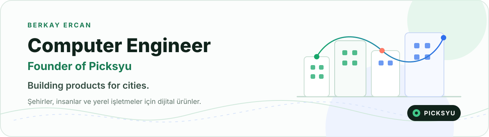
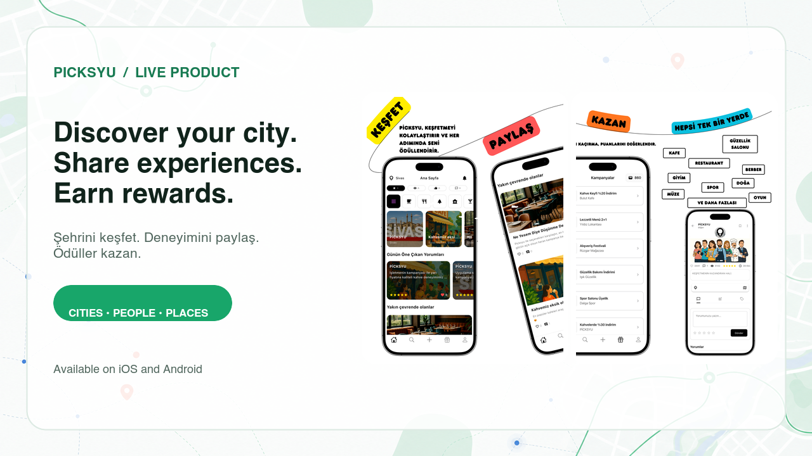
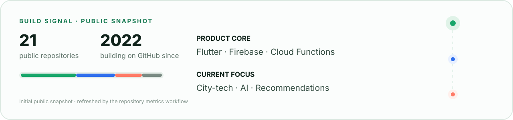

<picture>
  <source media="(prefers-color-scheme: dark)" srcset="./assets/hero-dark.svg">
  <source media="(prefers-color-scheme: light)" srcset="./assets/hero-light.svg">
  
</picture>

  
  
  

## Picksyu

**A city-focused discovery, social interaction and rewards platform.** 
Şehir odaklı keşif, sosyal etkileşim ve ödül platformu.

<a href="https://picksyu.com">
  <picture>
    <source media="(prefers-color-scheme: dark)" srcset="./assets/picksyu-showcase-dark.png">
    <source media="(prefers-color-scheme: light)" srcset="./assets/picksyu-showcase-light.png">
    
  </picture>
</a>

## Build signal

<picture>
  <source media="(prefers-color-scheme: dark)" srcset="./assets/metrics-dark.svg">
  <source media="(prefers-color-scheme: light)" srcset="./assets/metrics-light.svg">
  
</picture>

## Stack

  

## Connect

  
  
  
  

<!--
  Contribution snake is generated safely on the output branch by
  .github/workflows/snake.yml. It is intentionally not rendered until the
  first successful workflow run, so the profile never shows a broken image.
-->
